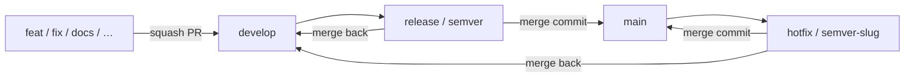

# Upriv GitFlow

This is the Git workflow for **this** repository. It is GitFlow-shaped (`main` + `develop` + short-lived working branches), with one convention for everyone: maintainer, future contributors, and coding agents.

It is adapted from [vinifen/gitflow-documentation](https://github.com/vinifen/gitflow-documentation) (MIT). There is **no** full/simple split here — Upriv uses a single profile.

| Audience | Start here |
|----------|------------|
| Humans (bug report, first PR) | [`CONTRIBUTING.md`](../../CONTRIBUTING.md) |
| Branches | [BRANCHES.md](BRANCHES.md) |
| Commits (including **author identity**) | [COMMITS.md](COMMITS.md) |
| Pull requests | [PULL-REQUESTS.md](PULL-REQUESTS.md) |
| Issues | [ISSUES.md](ISSUES.md) |
| Labels | [LABELS.md](LABELS.md) |
| Coding agents | [`.agent/GIT.md`](../../.agent/GIT.md) |

## Why this shape

Upriv is a **security-sensitive** desktop/mobile vault manager. History should be readable, issues should be easy to file, and PRs should be reviewable — even while only one person is shipping code.

- **Not GitHub Flow-only:** release and hotfix paths stay explicit (`main` is what users run; `develop` is where work lands).
- **Not heavy GitFlow:** no `@user/` branch prefix, no commit emoji or special characters, no time-spent fields, no required issue for every private chore.
- **Public-ready:** bug/suggestion templates, squash into `develop`, merge commits into `main`.

## Topology

```text
main      ── production / tagged releases only
develop   ── default integration branch (GitHub default)
│
├── feat|fix|docs|… /<issue>/<slug>   from develop → PR → squash into develop
├── release/<semver>                  from develop → merge into main and develop
└── hotfix/<semver>-<slug>            from main    → merge into main and develop
```



## Conventions (one page)

| Topic | Upriv rule |
|-------|------------|
| Default branch | `develop` |
| Production | `main` (tags `vMAJOR.MINOR.PATCH`) |
| Working branch | `type/slug` or `type/<issue>/slug` |
| Commit subject | `type(scope): imperative summary` — entire first line ≤ **120** chars; no emoji, no special characters (ASCII) |
| Commit author | Git `user.name` / `user.email`: **local if set, else global** — never an AI as author or co-author |
| PR into `develop` | squash |
| PR into `main` | merge commit (no squash) |
| Language | English |

**Types:** `feat` `fix` `docs` `style` `refactor` `perf` `test` `chore` `infra` `revert` `release` `hotfix`

**Scopes (optional, pick one primary):** `core` `rpc` `daemon` `ffi` `desktop` `electron` `mobile` `shared` `docs` `ci`

## Versioning

Released artifacts use [SemVer](https://semver.org/) `MAJOR.MINOR.PATCH`. Pre-1.0 (`0.y.z`) may still break; bump **minor** for notable features, **patch** for fixes. Tags look like `v0.1.0`.

The number lives in the repository-root **`VERSION`** file. After changing it, run `npm run sync-version --prefix dev`.

Release branches: `release/0.1.0` (dots, not underscores). Older names such as `release/0_0_1-beta` are historical.

Hotfix that ships a patch: `hotfix/0.1.1-mount-hang`.

## Clone identity

Commits use Git’s **effective** identity (local if set, otherwise your global `user.name` / `user.email`). Optional: pin this clone so it does not follow another machine’s global config (do this yourself; agents must never run `git config`):

```bash
git config --local user.name "Your Name"
git config --local user.email "you@example.com"
```

Details: [COMMITS.md](COMMITS.md).
